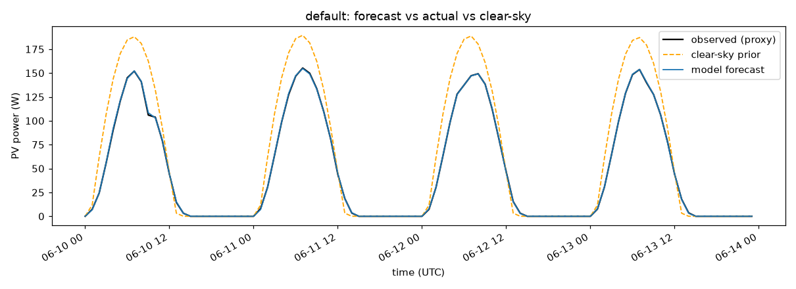

# Solar-Forecast (PhysSolar)

**Physics-informed machine learning for solar PV output forecasting** — a physical clear-sky model
sets the baseline, and machine learning learns only the weather-driven correction.

<p align="center">
  
  
  
  
  
  
  
</p>

I built this to forecast **solar PV output** from weather — and to learn **physics-informed ML**
hands-on. Rather than making a model learn everything from scratch, I give it a physical **clear-sky**
baseline (what a panel *should* produce on a cloudless day) and let ML learn only the **residual** —
the part clouds and temperature change. Final forecast = `clear_sky + residual(features)`, clipped `>= 0`.

## Highlights
- **Physics + ML hybrid** — a self-contained clear-sky irradiance model and plane-of-array (POA) transposition, corrected by a gradient-boosting residual model.
- **Beats standard baselines on real data** — 0.85 skill vs the clear-sky prior and 0.69 vs a persistence baseline on a full year of hourly data.
- **Honest evaluation** — leakage-free, forward-chaining backtest (train only on the past, test on the future).
- **Reproducible** — one CLI for fetch / train / evaluate / plot / predict, a Streamlit dashboard, and a test suite.

## Why this approach
Pure ML has to relearn physics it could simply be told. By encoding the sun's geometry and clear-sky
irradiance directly, the model only learns the weather-driven deviation — which is more data-efficient,
more interpretable, and degrades gracefully to the physical baseline when the model is unsure. This is
also the natural on-ramp to a **Physics-Informed Neural Network** (see the roadmap).

## Results
On a full real year (2023, hourly, ~8,760 points from Open-Meteo), a leakage-free forward-chaining backtest:

| metric | value |
|--------|-------|
| MAE | ~2.2 W |
| RMSE | ~4.4 W |
| **Skill vs clear-sky** | **0.85** — 85% lower RMSE than the physical baseline |
| **Skill vs persistence** | **0.69** — 69% lower RMSE than "same as 24 h ago" |

The residual model beats both standard baselines. Example day (forecast vs actual vs clear-sky):



## Tech stack
| Layer | Tools |
|-------|-------|
| Language | Python 3.10+ |
| ML | scikit-learn (gradient-boosted trees) |
| Numerics / data | NumPy, pandas |
| Physics | custom solar-geometry + clear-sky + isotropic POA (optional [pvlib](https://pvlib-python.readthedocs.io/)) |
| Data source | [Open-Meteo](https://open-meteo.com/) archive API (free, keyless) |
| Visualization | Matplotlib, Streamlit |
| Tooling | pytest, packaging via `pyproject.toml`, a `solar-forecast` CLI |

## How it works
```
weather (Open-Meteo)  ->  clear-sky physics prior  ->  features  ->  ML residual  ->  forecast = prior + residual
                                                                                         |
                                                                          leakage-free backtest + skill scores
```

| Module | Role |
|--------|------|
| `data` | Open-Meteo archive fetch + local cache (GHI, direct/diffuse, temp, cloud, wind) |
| `physics` | solar geometry, clear-sky irradiance, plane-of-array transposition + PV power model (the prior) |
| `features` | clear-sky index, angle-of-incidence, time encodings, weather, lags (no look-ahead) |
| `models` | baselines (clear-sky, persistence) + a gradient-boosting residual model |
| `evaluate` | MAE / RMSE / MBE / R2 + skill score; forward-chaining backtest |
| `cli` | fetch / train / predict / evaluate / plot |

New to the project? Start with **[docs/UNDERSTAND.md](docs/UNDERSTAND.md)** — a plain-English walkthrough
of how it works and how to run and experiment with it yourself.

## Install
```powershell
python -m venv .venv
.\.venv\Scripts\Activate.ps1
pip install -e .                 # core; add ".[physics]" for pvlib, ".[dashboard]" for Streamlit, ".[dev]" for pytest
```

## Usage
```powershell
solar-forecast fetch    --start 2023-01-01 --end 2023-12-31   # download + cache weather/irradiance
solar-forecast train    --start 2023-01-01 --end 2023-09-30   # train the residual model
solar-forecast evaluate --start 2023-01-01 --end 2023-12-31   # forward-chaining backtest vs baselines
solar-forecast plot     --start 2023-01-01 --end 2023-12-31   # save a forecast-vs-actual PNG
solar-forecast predict  --start 2023-12-01 --end 2023-12-07   # predict a date range
```

### Dashboard
```powershell
pip install streamlit
streamlit run app.py             # pick a day -> forecast vs actual vs clear-sky
```

## Roadmap
- **Physics-Informed Neural Network (PINN)** *(upcoming)* — replace the residual model with a small
  PyTorch network whose loss adds a **physics-consistency penalty** (e.g. output bounded by the
  clear-sky ceiling, non-negativity, energy consistency). Reuses this repo's physics model, data
  pipeline, and evaluation, so the PINN has a real baseline to beat.
- **Kaggle** *(upcoming)* — train the PINN on a free GPU and publish a public, reproducible notebook.
- **Real telemetry** — swap the v0 proxy target for measured inverter output (interfaces are ready).

## Docs
[Understand it](docs/UNDERSTAND.md) · [Implementation plan](docs/IMPLEMENTATION_PLAN.md) ·
[Architecture](docs/ARCHITECTURE.md) · [ML plan](docs/ML_PLAN.md) · [Physics](docs/PHYSICS.md) ·
[Math](docs/MATH.md) · [Research](docs/RESEARCH.md)

## Notes
- Python 3.10+. `pvlib` is optional (a self-contained clear-sky + transposition fallback is built in).
- v0 uses a proxy PV target derived from observed irradiance; the interfaces are ready to swap in real
  inverter telemetry.

## License
Released under the [MIT License](LICENSE).
